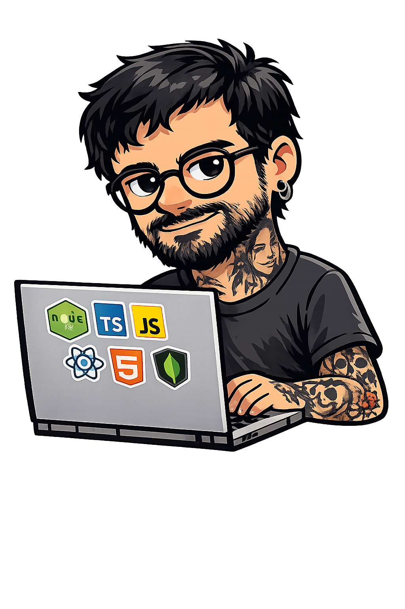

  <b>🏄‍♂️ Icaro Melo — Crafting modern web apps</b>

  

  

## About Me

- 💻 8+ years building production web applications  
- ⚛️ Strong focus on **React, TypeScript, Next.js**  
- 🧠 Passionate about **architecture, performance & scalable frontend systems**  
- 🌍 I'm based in Curitiba / Brazil  
- ✉️ You can contact me at **icaromelog@gmail.com**

## Skills

  

## What I Care About

- Clean architecture, maintainability and long-term scalability  
- Building reusable and scalable components (Design Systems, composition patterns)  
- Performance optimization (Core Web Vitals, rendering strategies, caching)  
- Choosing the right approach: SSR, SSG, ISR or client-side based on use case  
- Accessibility (semantic HTML, ARIA, inclusive UX practices)  
- Writing reliable tests (Jest, React Testing Library) focused on behavior  
- Code quality, readability and consistency (Clean Code, SOLID principles)  
- Developer experience (DX), documentation and good tooling  
- Collaboration between design, product and engineering for real product impact  

## Let's Connect

  
  

